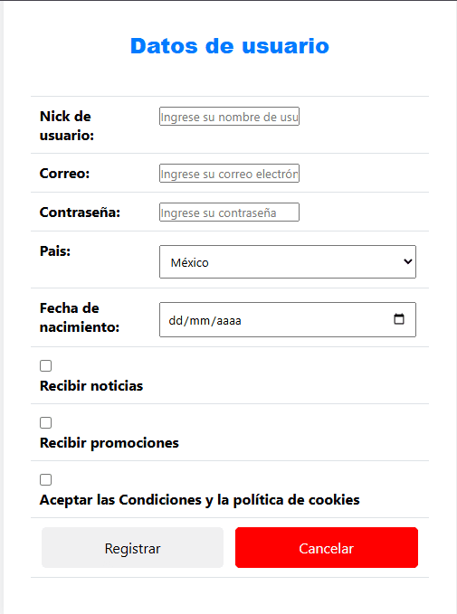

# Formulario de Registro de Usuario

Esta actividad consiste en un formulario de registro de usuario que permite a los nuevos usuarios proporcionar sus datos personales para crear una cuenta. La aplicación web valida y procesa la información ingresada, almacenando los detalles del usuario y permitiendo opciones de suscripción a noticias y promociones. Este proyecto es un ejemplo de la implementación de formularios en HTML y el manejo de datos en el backend utilizando PHP.

  

Campos para ingresar el nombre de usuario, correo electrónico, contraseña, país y fecha de nacimiento.

El script PHP procesa los datos ingresados en el formulario:

- **Procesamiento de Datos:** Valida y procesa los datos enviados desde el formulario. Muestra la información del usuario y sus preferencias seleccionadas.

- **Validación de Checkboxes:** Verifica las opciones seleccionadas para noticias y promociones, así como la aceptación de los términos y condiciones.

Esta actividad demuestra habilidades en la creación de formularios web, validación de datos del usuario y procesamiento en el servidor, proporcionando una base sólida para aplicaciones web que requieren la recolección y manejo de información de los usuarios.

**Consulta la versión preliminar de la actividad aquí:** [https://ejercicio_08.com](https://www.alejandrovillegas.dev/projects/exercise-08/index.html)

# 📌 Información de la Actividad

Esta actividad ha sido desarrollado como parte del portafolio de soluciones tecnológicas, con el objetivo de ofrecer una herramienta eficiente y funcional para usuarios autodidactas interesados en la gestión y desarrollo de proyectos web.

- **Área**: Desarrollo de Actividades Web

- **Usuario Final**: TecNM

- **Fecha de Desarrollo**: 30 de agosto de 2018

- **Portafolio de Proyectos**: [www.alejandrovillegas.dev](https://www.alejandrovillegas.dev)

## 🔧 Guía de Instalación y Configuración de la Actividad

1. Descargue y descomprima el archivo del proyecto en su sistema local.

La actividad ahora está funcionando en su entorno local. 🎉
